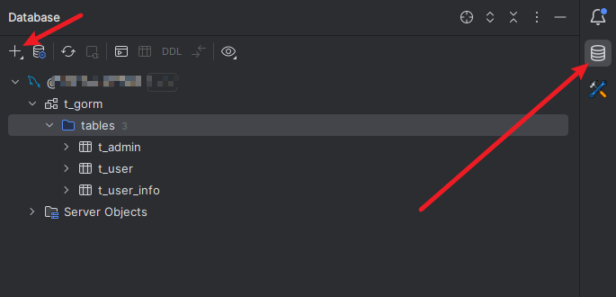
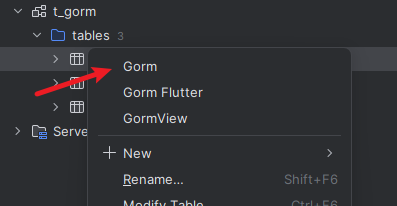
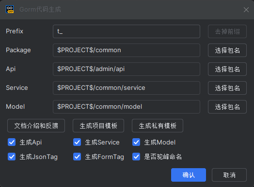
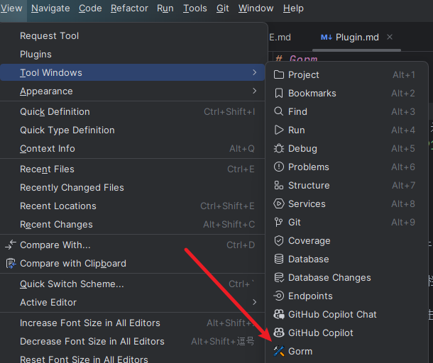
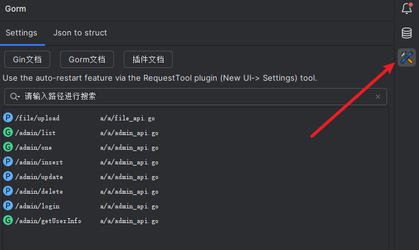
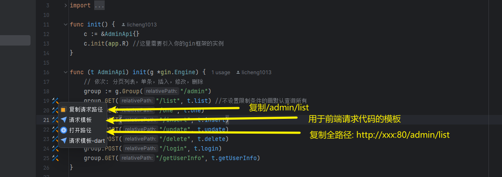
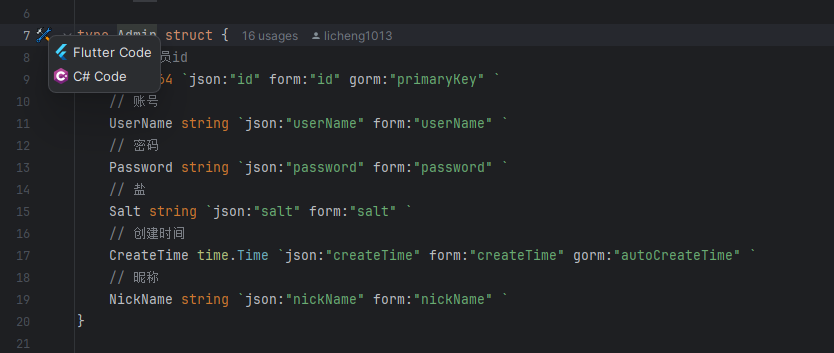
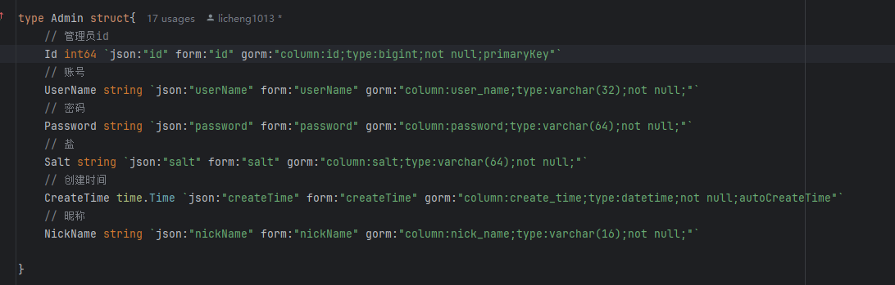

# Gorm

## 介绍

- 本项目是 `Gorm` 插件的示例项目
- 有问题可以加QQ群: `289132257`

### 生成代码

- 2024.1.1 +插件版本
- 1.打开Database插件进行连接数据库
- 
- 2.在右侧(一般情况)工具栏选择
- 
- 3.选择要生成的表进行右击
- 
- 4.选择生成的目录
- 
- 5.`支持模板生成可定制` 
- 模板配置目录在 .idea/gorm/mvc (默认可能是隐藏,通过文件管理器查看)
- 其次是项目下 gorm/mvc 目录(优先级高)

### 接口导航

- 1.打开`Gorm`插件
- 
- 2.在右侧(一般情况)工具栏选择
- 
- 3.可以根据路由进行接口搜索(`注意需要按指定方式配置接口`)

### 接口扩展

- 1.扩展功能
- 
- 2.`支持请求模板可定制`
- 3.如果有多套请求模板,请通过 [myData.json](gorm/myData.json) 的数组字段 `extendTag` 进行扩展,如:

```json
{
  "extendTag": [
    "-dart",
    "-kt"
  ]
}
```
- 模板配置目录在 .idea/gorm (默认可能是隐藏,通过文件管理器查看)
- 其次是项目下 gorm 目录(优先级高)

### 结构体扩展

- 1.扩展功能,可将Go结构体转换为其他语言类
- 


## 设置

- 文件配置一般在 .idea/gorm 或者 gorm 目录下

## Mvc.Json

- 此文件有些设置需要注意: [Mvc.Json](gorm/Mvc.Json)
- 如果字段不存在可以手动添加进去即可
 
| 参数                 | 描述                                     | 插件版本要求    |
|--------------------|----------------------------------------|-----------|
| enableSqlNull      | 为 `true` 则开启sqlNull模式。 默认为`false`      |           |
| enableCommonResult | 为 `true` 则生成一个返回结果类(在模型目录下)。 默认为`true` | 2024.1.2+ |
| pathPrefix         | 控制台路径导航到接口设置,默认为""空, 解决全局前缀路径没法识别      | 2024.1.3+ |
| enableGormTag      | 为 `true` 则开启gorm tag的信息 。 默认为`true`    | 2024.1.5+ |


### enableGormTag

- 示例
- 

