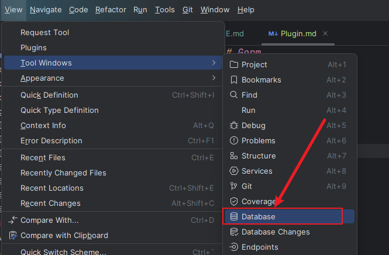

# Gorm

## 介绍

- 本项目是 `Gorm` 插件的示例项目
- 有问题可以加QQ群: `289132257`
-

### 生成代码

- 2024.1.1 +插件版本
- 1.打开Database插件进行连接数据库
- 
- 2.在右侧(一般情况)工具栏选择数据库插件进行连接数据库
- 
- 3.选择要生成的表进行右击
- 
- 4.选择生成的目录
- 

### 接口导航

- 1.打开`Gorm`插件
