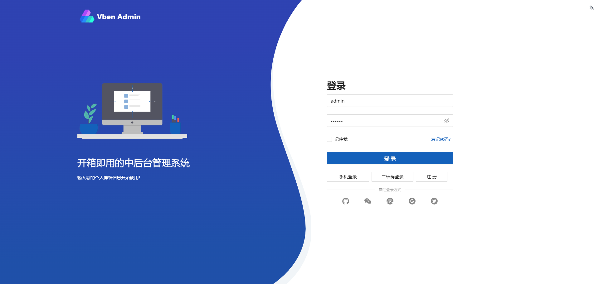
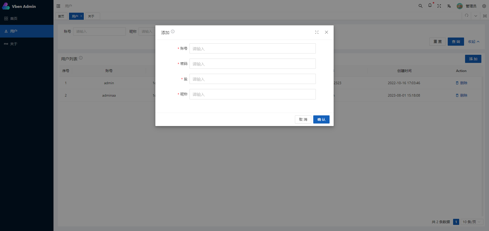
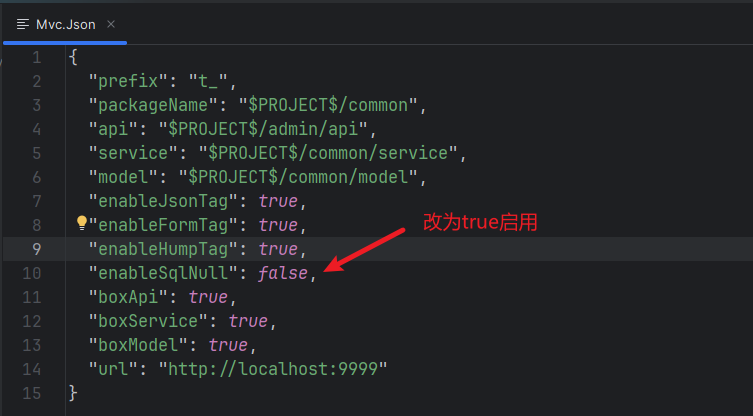

# GormTemplate

## 介绍

- Goland `Gorm插件`示例模板项目, 插件件地址: [gorm](https://plugins.jetbrains.com/plugin/20411-gorm/)
- 同时也是一个前后端分离的后台管理系统模板项目
- 可基于此项目进行二次开发.
- 有问题可以加QQ群: `289132257`

## 要求
- 安装 go 1.19+
- 安装 node 16+
- 安装 pnpm 8.6+

## 技术

| 技术列            | 描述       | 官网                                                       | 整合 |
|----------------|----------|----------------------------------------------------------|----|
| gin            | web框架    | [gin-gonic](https://gin-gonic.com/zh-cn/docs/)           | 🆗 |
| gorm           | orm框架    | [gorm.io](https://gorm.io/zh_CN/docs/index.html)         | 🆗 |
| mysql          | 数据库      |                                                          | 🆗 |
| jwt            | 认证       | [golang-jwt](https://github.com/golang-jwt/jwt)          | 🆗 |
| cors           | 跨域       |                                                          | 🆗 |
| lancet         | 工具库      | [lancet](https://github.com/duke-git/lancet)             | 🆗 |
| gorm插件         | 增删改查代码生成 | [gorm](https://plugins.jetbrains.com/plugin/20411-gorm/) | 🆗 |
| vue-vben-admin | 基于此前端项目  | [vben-js](https://github.com/vbenjs/vue-vben-admin)      | 🆗 |

## 快速上手

- 1.克隆本项目
- 2.创建数据库并导入sql -> t_gorm.sql, 修改 admin/app.yml 配置文件 mysql 链接
- 3.安装go依赖并运行admin/main.go
- 4.安装pnpm
- 5.进入view目录 运行pnpm install
- 6.进入view目录 pnpm run dev

## 演示页面

## sqlNull模式

- 如何开启?
- 
- 此文件存在于: 项目根目录下 `gorm` 或者 `.idea/gorm` 目录 
- 如果没有此属性可以手动添加进去即可.
- 插件版本: 2024.1.1+ 

## 插件功能

-  表示: `🆗:完成,❌:未完成`

| 功能        | 是否完成 |
|-----------|------|
| 后端代码生成    | 🆗   |
| 前端代码生成    | 🆗   |
| Api导航     | 🆗   |
| Api调试     | 🆗   |
| Api复制     | 🆗   |
| 客户端请求代码模板 | 🆗   |

## 帮助

- QQ群: 289132257
